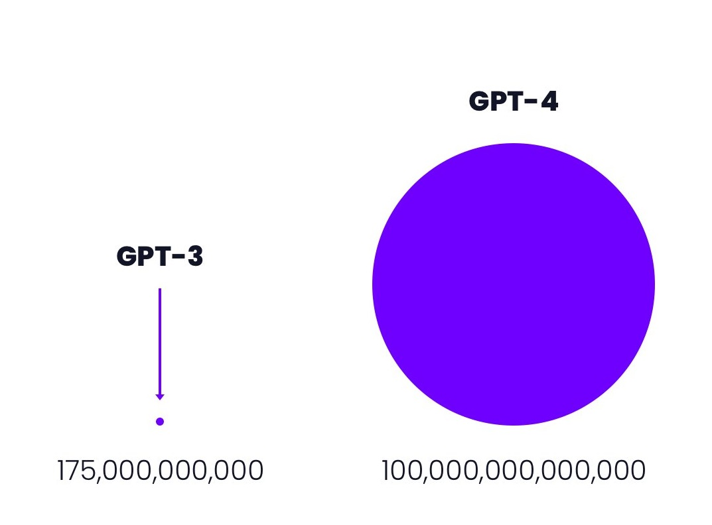

# Translink Deep Tech Weekly (DTW)

🌍 Website: [link](https://cdrhim.github.io/dtw/)\
💾 Repository: [link](https://www.github.com/cdrhim/dtw/)

- [DTW-1](#week-1-dtw-1)

----------

## Week 1 (DTW-1)

- ChatGPT를 분해해 보면 그 **구조**가 어떻게 되어있을까?
 
 

*OpenAI. (2022, Nov. 30). ChatGPT: Optimizing Language Models for Dialogue. https://openai.com/blog/chatgpt/*

1. 인터넷 상 570GB 정도의 텍스트 데이터(또는 3000억 개의 단어들)를 추출함
2. 이 데이터를 활용하여 prompt (question)데이터셋을 구축함
3. 레이블링하는 사람이 prompt (question)데이터셋으로부터 output (answer)을 만들어 모아진 데이터로 지도학습모델을 훈련함(지도학습은 input과 output 예시 데이터셋이 있을 시에 가능한 머신러닝 기법이다)
4. 후에 output에 대한 사람의 직접적인 피드백(best-to-worst를 순차적으로 나열)을 통한 보상모델을 훈련함(보상모델은 강화학습을 하기 위해 활용된다)
5. 어느정도 원하는 수준의 답을 내기까지 계속된 강화학습을 진행

*(On Prem이 아닌 Azure AI Infrastructure를 통해 모든 학습이 이루어지었다.)* \
*(강화학습은 과거 알파고를 개발할 때에도 쓰인 기술이다. 보통 게임승부와 같은 태스크에서 강화학습이 쓰인다.)* \
*(예전에 2021년 GPT-3를 베타 테스트 웨이팅리스트 기회가 와서 했을 때에 비해 ChatGPT는 더 긍정적인 톤의 답을 내놓는다는 생각이 들어서 최근 2022년 3월부터 적용한 강화학습([link](https://arxiv.org/abs/2203.02155))은 이에 대한 효과가 있을 수 있겠다 생각했다.)*

따라서, 지도학습과 강화학습을 적절히 조합한 방식으로 ChatGPT를 학습했다고 볼 수 있다.

- ChatGPT는 결국 GPT-3 기반으로 같은 수의 175B 파라미터로 만들어진 GPT-3.5와 동의어로 생각할 수 있고, InstructGPT의 연장선이라 볼 수 있다. GPT-1("Improving Language Understanding by Generative Pre-training", [link](https://s3-us-west-2.amazonaws.com/openai-assets/research-covers/language-unsupervised/language_understanding_paper.pdf))부터 시작해, GPT-2("Language Models are unsupervised multitask learners", [link](https://cdn.openai.com/better-language-models/language_models_are_unsupervised_multitask_learners.pdf)), GPT-3 ("Language Models are few shot learners", [link](https://arxiv.org/pdf/2005.14165.pdf)), 그리고 GPT-3.5까지 발전했다. 곧 파라미터 수가 확 늘은 GPT-4가 만들어질 것이라 계속해서 발전된 형태의 output을 기대할 수 있다. **GPT-4는 2023년 1분기에 나올 수 있다**는 추측이 있다([link](https://the-decoder.com/gpt-4-only-launches-when-it-is-safe-and-responsible/)). 그리고 2021년 이후의 더 최신 데이터를 input으로 넣는지에 따라 더 좋은 결과를 낼 수 있다.

*Acquisition.com LLC. https://acquisition.com*

- ChatGPT 특이점: 과거 유명해지고 현재까지 쓰이는 인공지능 기술들인 이안 굿펠로우(Ian Goodfellow)의 2014년 [General Adversarial Networks (GAN)](https://arxiv.org/abs/1406.2661)이나 벤 밀든홀(Ben Mildenhall), 매튜 탄식(Matthew Tancik)의 2020년 [NeRF (Neural Radiance Fields)](https://arxiv.org/abs/2003.08934)는 유명 학회나 저널을 통해 발표된 기술들이다. GAN은 NIPS란 학회에 accept이 되었고, NeRF는 ECCV의 Oral 부문에서 Best Paper 상을 받았다. 어떤 사람이 처음 어떤 기술을 제안했는지 알 수 있고, 어떤 매체의 검증을 거쳤는지 알 수 있었다. 그러나 ChatGPT는 이와 다르게 peer review로 제3자의 검증을 거치지 않았다는 특이점이 있고, 학계가 아닌 기업에서 발표된 점이 흥미로울 수 있다. 그리고 source code가 오픈소스로 공개되지 않아 정확히 어떤 기존 데이터나 모델을 활용하고 했는지 알 수 없다. 흥미롭게도 이안 굿펠로우는 2016년 3월에 OpenAI에 조인을 했다가 11개월 만에 다시 Google Research로 복귀한 바가 있다. SOTA (최고성능, State of the Art)를 내는 인기 기술로는 어떤 태스크([link](https://paperswithcode.com/sota))에 적용하느냐에 따라 다양한 것들이 있으며, Transformers, CLIP, GAN, NeRF, Stable Diffusion 등이 있다.

- ChatGPT 우려점: 데이터를 Stack Overflow와 같은 타 사이트를 scrapping 또는 crawling 해서 integrity 이슈가 생길 수 있다. 보통 웹사이트 상 프론트 부분인 UI에서 보여지는 어떤 데이터든 scrapping 하는 것에는 법적인 문제가 없지만, 이를 통해 제3자가 2차 수익을 내는 것은 문제가 있을 수 있다. Y Combinator에서는 어제(2023년 2월 5일) 이에 대한 댓글토론도 있었는데, 실상 ChatGPT의 합법성에 대해 어떤 답이 내려진 상태가 아니다([link](https://news.ycombinator.com/item?id=34664998&ref=upstract.com)). 또, 틀린답을 내놓을 수 있기 때문에 output에 대해 검증을 하는 수단이 또 필요하게 될 것이다.

- 서버 비용이 학습하고 추론하는 데에 많이 쓰여 research preview 때만 제공하려던 무료서비스를 지속할 수 없을 수 있고, 결국 올해 2023년 마이크로소프트가 29B USD valuation으로 10B USD 투자로 49% 지분의 대주주가 되면서 유료 서비스가 생겼다([link](https://www.forbes.com/sites/dereksaul/2023/01/10/microsoft-reportedly-closing-in-on-10-billion-investment-into-chatgpt-creator-openai/?sh=5bb729fa3204)). 마이크로소프트가 Open AI 인수함에 따라 AWS, GCP, Azure의 market share도 Azure의 홍보에 의해 달라질 수 있을 것이다. 한국에서 주로 쓰이는 AWS와 GCP 사이에 Azure 사용자가 늘 수 있다. 또, Bing에게 적용이 될 ChatGPT를 통해 Bing의 사용량이 늘 수 있을 것이라 Google search engine의 market share도 줄 수 있다. 

<!-- You may change the values of width and height above to resize the chart -->
Source: <a href="https://gs.statcounter.com/search-engine-market-share">StatCounter Global Stats - Search Engine Market Share</a>

- Multi-modal learning AI를 통해 앞으로 text의 한 도메인 학습보다 text-to-image (DALL-E), text-to-video 등의 멀티 도메인 generative AI가 더 흥행할 수도 있을 것이다. ChatGPT는 챗봇의 형태로 특수하게 훈련된 모델인데, 그 이후로 CLIP이란 기술을 통해 이미 만들어진 text-to-image 모델인 DALL-E 2([link](https://openai.com/dall-e-2/))를 능가하는 더 섬세하고 semantic한 그림을 생성하는 DALL-E 3나, 2d를 넘어서는 3d 이미지 생성이나, 비디오 생성을 하는 단계까지 갈 수 있다.

- 또한, 최근 대두되는 것은 OpenAI에서 근무한 분들이 차린 스타트업의 성장세이다. 2021년에 세워진 Anthropic은 Claude란 챗봇을 따로 만들어서 2022년 말에 Google이 300 million USD를 여기에 투자했다([link](https://www.theverge.com/2023/2/3/23584540/google-anthropic-investment-300-million-openai-chatgpt-rival-claude)). ChatGPT는 인간의 피드백을 수용한 강화학습의 일종인 reinforcement learning from human feedback (RLHF)을 따랐고, Anthropic은 Constitution AI란 모델을 써서 fine-tuned된 아웃풋에 대해 인간이 아닌 컴퓨터가 강화학습을 진행하도록 한 차이가 있다([link](https://scale.com/blog/chatgpt-vs-claude)).

- 2023년 서울대 이교구 교수님의 Supertone (Mnet, SBS 등에서 죽은 가수가 환생해 최신곡을 커버함)을 인수한 하이브처럼 최신 리서치에 관심이 있는 스타트업이 경쟁력이 있고 IP확보에 유리할 것이다. Supertone과 같은 경우에는 글쓴이 본인의 옆 연구실이었고, 교수님의 수업을 들은 바로 음성 뿐만이 아니라 안무를 음악비트에 맞춰 생성한다든지의 연구가 수년 간 이루어졌다. 

- 인공지능 컨텐츠 쪽에 voice.ai를 보면 유튜브에 쇼츠로 일반인이 일론 머스크의 비디오로 다른 목소리(모간 프리먼, 조 바이든, 앤드류 테이트 등 50여 가지)와 sync를 맞출 수 있는 예시들을 유저들이 꾸준히 체험해 볼 수 있게끔 한다([link](https://youtube.com/shorts/S84CgeVCNO8?feature=share)). 다른 비디오에서는 Roblox에 voice.ai를 통해 목소리를 입히는 법을 알려준다. 같은 퀄리티의 Core AI 기술이더라도 각종 창의적인 수단으로 B2C, B2B 홍보하고 입소문이 잘 나게끔 하는 스타트업들이 ChatGPT와 같은 폭팔적 인기를 끌 수 있을 것이다.

- NVIDIA와 같은 경우에도 눈의 시선을 자연스럽게 보정해주는 기술(Broadcase)이 개발이 되었고, 2023년 현재 1.4버전 서비스 중이다.
https://www.nvidia.com/en-us/geforce/news/jan-2023-nvidia-broadcast-update/

- Microsoft Teams가 Notion보다 인기가 많아진 이유는 이미 선점하고 있던 Windows의 distribution 때문.

### 최신 핫한 논문들에 대한 내용은 다음주 DTW-2에 확인가능

- 논문을 내는 곳 중에 컨퍼런스와 저널 등이 있고, IF가 높을수록 더 명성이 높은 곳이라 할 수 있다. ICLR, NIPS, ICML, AAAI, CVPR 등이 있다([link](https://scholar.google.es/citations?view_op=top_venues&hl=en&vq=eng_artificialintelligence)).

- 논문을 제출해서 accept되고 출판될 때 바로 핫해지는 논문이 있는가 하면, 한참 후에 유명해지는 논문들도 있다. 보통은 산업에서 쓰이기 전에 이미 쓰일 논문 기술들은 유명해진다(2014년 처음 나왔던 GAN은 2020년 취업을 할 때에도 여러 스타트업에서 쓸 수 있는지 취업공고에 적시하기도 했다).

<!---
Week 2
- About all the licenses that could be included in open source software (Apache 2.0, etc.).
- 테크 기업들에 대한 미국의 최신 valuation 방법들
- Midjourney

-->
